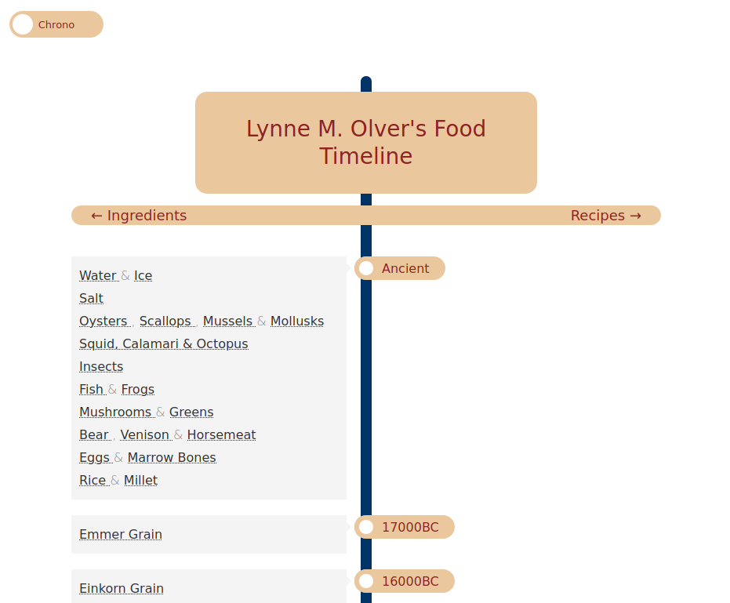
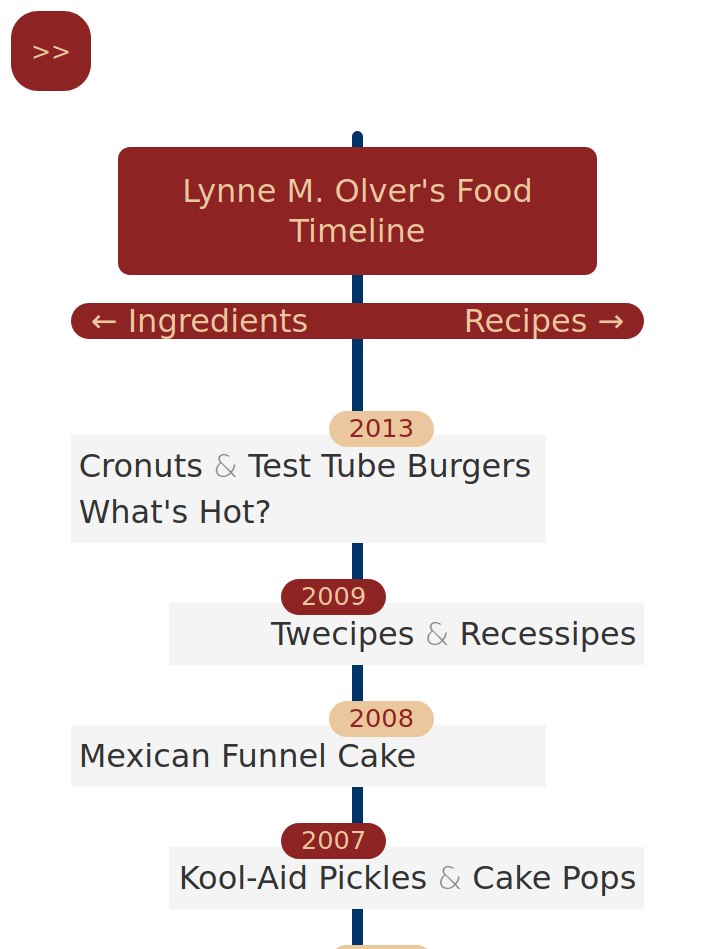

# Olver's Food Timeline
This project is a reworking of the food/culinary timeline found at the venerable [FoodTimeline.org](https://foodtimeline.org/) website, which was first created in the late 1990s by Lynn M. Olver. The main goal was to make the timeline friendlier to use on modern desktop and mobile web-browsers and allow the timeline display to be dynamically generated.

To do this, the data had to be separated and made independent from the rendering. I took the original manually coded HTML content of the website, corrected it for consistency, parsed it using [Beautiful Soup 4.9](https://www.crummy.com/software/BeautifulSoup/bs4/doc/), and formatted the contents into JSON. The website's rendering was implement using javascript and CSS, which allowed the user to display the timeline in chronological or reverse-chronological order. Note, all links point back to pages at the original website.

This was initiated to re-familiarize myself with some tools of webdev after almost 2 decades of abstinence.

It is a work-in-progress.

[Demo Here](https://sjschen.github.io/CulinaryTimeline/)

